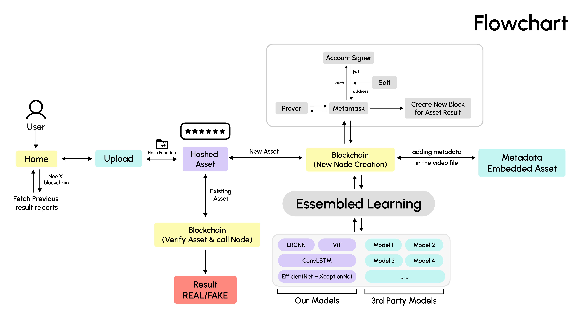
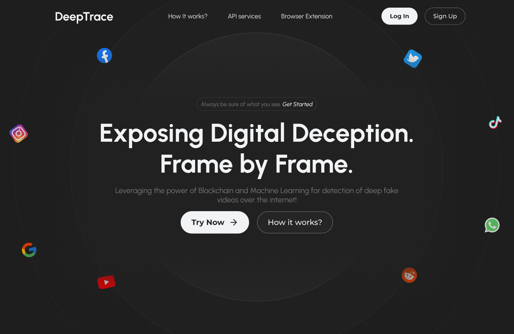
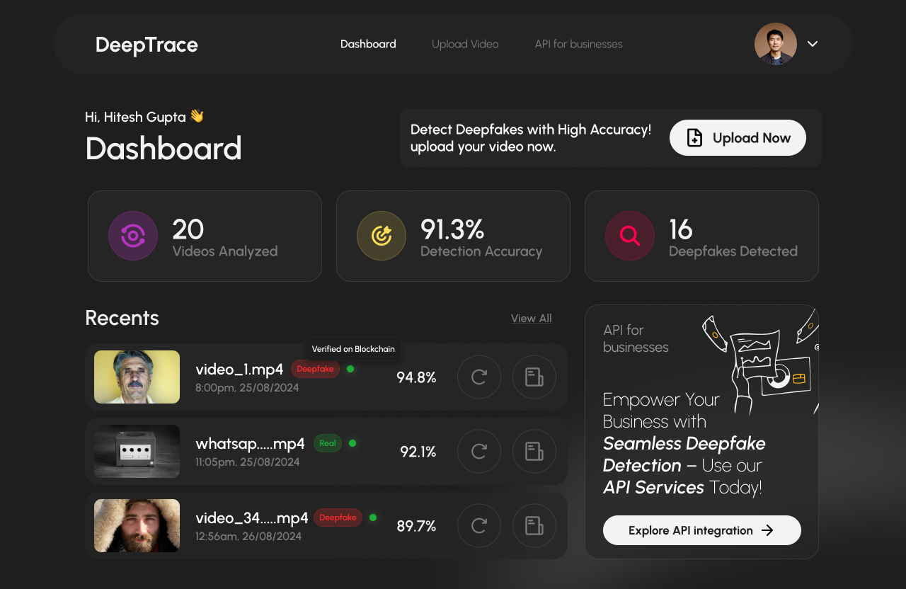
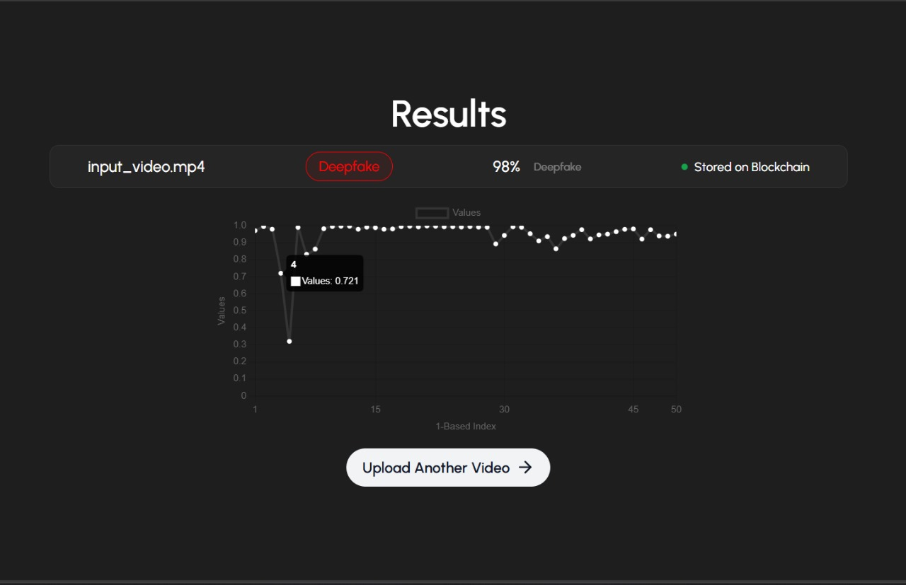

# DeepTrace

## Teaser:

### Click for Video 👇🏻👇🏻

[](https://youtu.be/k2KG_4mlOEo)

**DeepTrace** is an innovative blockchain-based platform designed to combat the growing issue of deepfake videos by leveraging advanced technology and ensuring user privacy. By utilizing the immutable and decentralized nature of blockchain, DeepTrace delivers a highly accurate and trustworthy solution for detecting and mitigating deepfake content worldwide.

## Our main goal is not only to detect , but also prevent the illicit practices of AI.

## Features

### <u>AI-Enhanced Multi-Model Detection:</u>

DeepTrace employs a multi-model approach, combining insights from various AI models to enhance detection accuracy and provide a more reliable assessment of video authenticity. This feature allows for:

- **Rapid Detection**: Quick identification of deepfake content across platforms, enabling timely interventions.
- **Scalability**: Suitable for both individual users and large enterprises, supporting high volumes of video processing.

### <u>Blockchain-Backed Verification:</u>

DeepTrace integrates blockchain technology, similar to C2PA, to securely embed verification details directly into a video’s metadata. This approach offers:

- **Immutable Records**: Ensures that once a video is created or modified, its authenticity and history are permanently recorded.
- **Traceability**: Easy tracing of the video's origins and modifications, ensuring content trustworthiness and transparency.

### <u>Metadata-Embedded Blockchain Details:</u>

Just like C2PA (Coalition for Content Provenance and Authenticity) technology embeds provenance data directly into content files to verify their origin and history, the Metadata-Embedded Blockchain in DeepTrace works similarly. It integrates blockchain verification details directly into the video’s metadata. This means that every time a video is created or modified, the authenticity and historical record of that content are securely embedded within the video itself. This embedded information, much like C2PA’s provenance data, allows anyone to easily trace and verify the video's integrity at any point in time, ensuring that the content is trustworthy and its origins are transparent.

### Ensemble Learning:

We are utilizing advanced AI/ML techniques, including technologies like ensemble learning and federated learning, to deliver robust results. Ensemble learning involves combining multiple AI models into a single model in a way that considers both bias and variance. We achieve this by aggregating the weights of all the models before the MLP/Segmentation Head, followed by adding downsampling layers.

### <u>Real-Time Detection:</u>

Offers rapid analysis capabilities, allowing for immediate identification of potential deepfakes across various platforms and media channels, providing timely interventions.

### <u>Business API Integration:</u>

Provides a comprehensive API tailored for businesses, enabling seamless integration of DeepTrace's deepfake detection capabilities into existing workflows and platforms. This allows organizations to safeguard their content and ensure the authenticity of media shared within and outside the company, while maintaining high standards of privacy and security.

### Third Party Integration:

As the world of deepfake generation continues to evolve, we need to stay ahead of the curve. Therefore, we will invite major companies and developers to integrate their APIs into our product. We will test these APIs on our custom-generated dataset to reduce bias and variance.

## Workflow and Images

### Workflow



### Project Images







## How to set up this project

```
git clone https://github.com/HitG010/DeepTrace
npm i
npm run dev
cd Backend
npm i
nodemon server.js
```

### To set up blockchain

```
cd ./Smart Contract/
npm i
npx hardhat node
```

(Open another instance of bash)

```
cd ./Smart Contract/
npx hardhat run scripts/deploy.js --network localhost
```

### How to set up Python backend for AI/ML

```
pip install -r requirements.txt
cd models
git clone https://github.com/polimi-ispl/icpr2020dfdc
cd icpr2020dfdc/notebook
python3 ../../app.py
```

### Lastly set up neoX destnet on your metamask wallet and get some test tokens from [here](https://neoxwish.ngd.network/).

## Our Contact info

Team Name : < FigureOut />

Team Members : Kartik Bindra, Hitesh Gupta, Devyansh
Bhattacharya

[Email](mailto:guptahitesh201105@gmail.com)

Phone : +91 8595867129.
